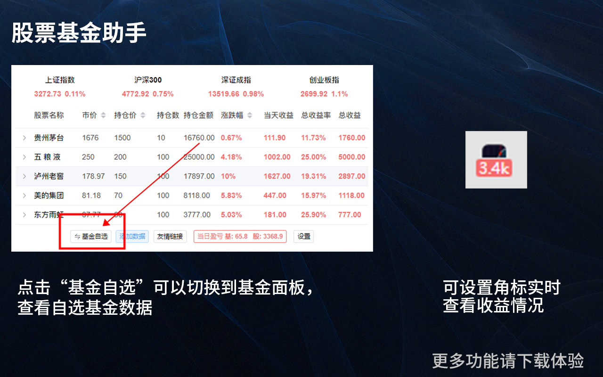

## 股票基金助手
最近自己开发了一款炒股看基金的浏览器插件，非常适合上班族使用，目前感觉是功能最全最好用的炒股类插件；
下载地址  
[Chrome 浏览器（需要翻墙）](https://chrome.google.com/webstore/detail/%E8%82%A1%E7%A5%A8%E5%9F%BA%E9%87%91%E5%8A%A9%E6%89%8B-%E7%9B%AF%E7%9B%98%E5%8A%A9%E6%89%8Bpro/folafkamgdbhdeejjhohajojeogpoknm?hl=zh-CN&authuser=0)

[Edge 浏览器](https://microsoftedge.microsoft.com/addons/detail/%E8%82%A1%E7%A5%A8%E5%9F%BA%E9%87%91%E5%8A%A9%E6%89%8B-%E7%9B%AF%E7%9B%98%E5%8A%A9%E6%89%8Bpro/bpifkekjlkihhepmjnhenheaaancdamo?hl=zh-CN)

[Firefox火狐 浏览器](https://addons.mozilla.org/zh-CN/firefox/addon/%E8%82%A1%E7%A5%A8%E5%9F%BA%E9%87%91%E5%8A%A9%E6%89%8B-%E5%AE%9E%E6%97%B6%E6%9F%A5%E7%9C%8B%E5%9F%BA%E9%87%91%E6%B6%A8%E8%B7%8C%E5%B9%85/?utm_source=addons.mozilla.org&utm_medium=referral&utm_content=search)

[如360、QQ、UC等浏览器请访问](https://pu_shu.gitee.io/func/)

本扩展支持基金、A股、债券、港股、美股等 功能最全、数据准确、实时，并且可以实时查看大盘动态；

本插件非常适用于： 基金用户、股票用户 、股票基金用户；

安装该扩展后，可以使用以下功能：

1. 可以自选A股市场中所有的基金和股票。自选后会实时的跟踪自选的产品，无需再频繁的拿手机或者点开券商网站来查看数据，不用担心因错过最佳的操作时机；

2. 可以实时查看基金或者股票走势图及张跌幅；

3. 可以通过设置角标，来实时的显示收益数据；

基金用户：
1. 可以查看对应基金的持仓股票，对基金为什么涨跌一目了然；

股票用户：
1. 直接查看股票的当天开盘的数据如：开盘价、收盘价、成交量等数据；
2. 提供股票的当前走势图，以及当前价格的成交量；
3. 提供日K、周K、月K等K线图
4. 提供通知提醒功能，达到设定的上下线价格发送桌面通知

股票基金都买的用户：
1. 以上股票和基金的用户的功能都包含；
2. 提供一键切换面板，可以随时的切换到基金面板或者股票面板；

下载地址  
[Chrome 浏览器（需要翻墙）](https://chrome.google.com/webstore/detail/%E8%82%A1%E7%A5%A8%E5%9F%BA%E9%87%91%E5%8A%A9%E6%89%8B-%E7%9B%AF%E7%9B%98%E5%8A%A9%E6%89%8Bpro/folafkamgdbhdeejjhohajojeogpoknm?hl=zh-CN&authuser=0)

[Edge 浏览器](https://microsoftedge.microsoft.com/addons/detail/%E8%82%A1%E7%A5%A8%E5%9F%BA%E9%87%91%E5%8A%A9%E6%89%8B-%E7%9B%AF%E7%9B%98%E5%8A%A9%E6%89%8Bpro/bpifkekjlkihhepmjnhenheaaancdamo?hl=zh-CN)

[Firefox火狐 浏览器](https://addons.mozilla.org/zh-CN/firefox/addon/%E8%82%A1%E7%A5%A8%E5%9F%BA%E9%87%91%E5%8A%A9%E6%89%8B-%E5%AE%9E%E6%97%B6%E6%9F%A5%E7%9C%8B%E5%9F%BA%E9%87%91%E6%B6%A8%E8%B7%8C%E5%B9%85/?utm_source=addons.mozilla.org&utm_medium=referral&utm_content=search)

[如360、QQ、UC等浏览器请访问](https://pu_shu.gitee.io/func/)

## 预览图

下载地址  
[Chrome 浏览器（需要翻墙）](https://chrome.google.com/webstore/detail/%E8%82%A1%E7%A5%A8%E5%9F%BA%E9%87%91%E5%8A%A9%E6%89%8B-%E7%9B%AF%E7%9B%98%E5%8A%A9%E6%89%8Bpro/folafkamgdbhdeejjhohajojeogpoknm?hl=zh-CN&authuser=0)

[Edge 浏览器](https://microsoftedge.microsoft.com/addons/detail/%E8%82%A1%E7%A5%A8%E5%9F%BA%E9%87%91%E5%8A%A9%E6%89%8B-%E7%9B%AF%E7%9B%98%E5%8A%A9%E6%89%8Bpro/bpifkekjlkihhepmjnhenheaaancdamo?hl=zh-CN)

[Firefox火狐 浏览器](https://addons.mozilla.org/zh-CN/firefox/addon/%E8%82%A1%E7%A5%A8%E5%9F%BA%E9%87%91%E5%8A%A9%E6%89%8B-%E5%AE%9E%E6%97%B6%E6%9F%A5%E7%9C%8B%E5%9F%BA%E9%87%91%E6%B6%A8%E8%B7%8C%E5%B9%85/?utm_source=addons.mozilla.org&utm_medium=referral&utm_content=search)

[如360、QQ、UC等浏览器请访问](https://pu_shu.gitee.io/func/)

关键字：炒股插件, 炒股浏览器插件，浏览器炒股插件，基金插件，基金浏览器插件，浏览器基金插件，盯盘插件，盯盘浏览器插件，浏览器盯盘插件，A股插件，A股浏览器插件，浏览器A股插件，chrome炒股看基盯盘插件, Edge炒股看基盯盘插件, 火狐(Firefox)炒股看基盯盘插件，360炒股看基盯盘，UC炒股看基盯盘

